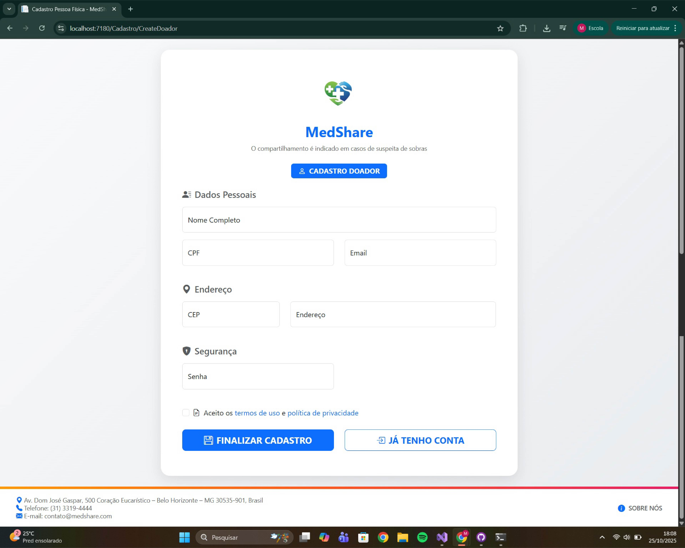

# Template Padrão da Aplicação

## Layout Telas Padrão
Layout padrão da aplicação que será utilizado em todas as páginas com a definição de identidade visual, aspectos de responsividade e iconografia.

## Layout Telas de Cadastro
Layout padrão da aplicação que será utilizado em todas as páginas de cadastro com a definição de identidade visual, aspectos de responsividade e iconografia.

