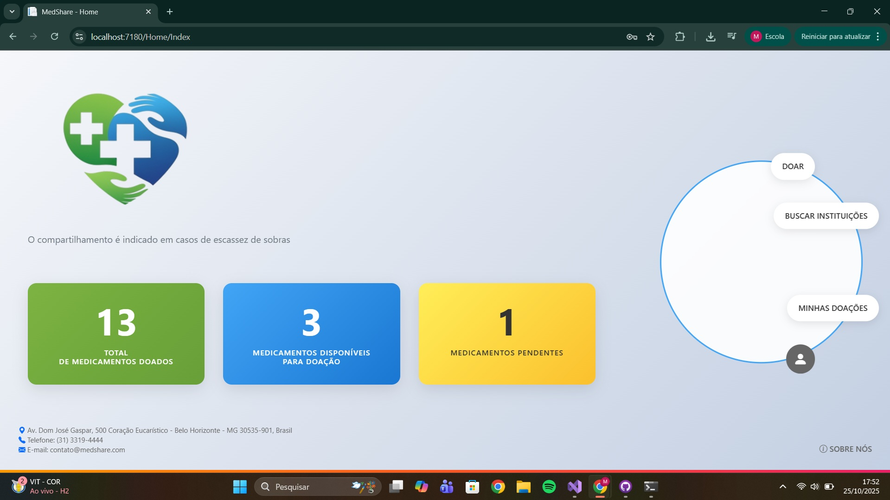

# Template Padrão da Aplicação

## Layout padrão

O layout apresentado a seguir é o layout padrão da aplicação que será utilizado em todas as páginas, com definição da identidade visual, aspectos de responsividade e iconografia.

## Layout das telas de cadastro

O layout apresentado a seguir é o layout padrão que será utilizado em todas as páginas de cadastro da aplicação, também seguindo a identidade visual, aspectos de responividade e iconografia.

