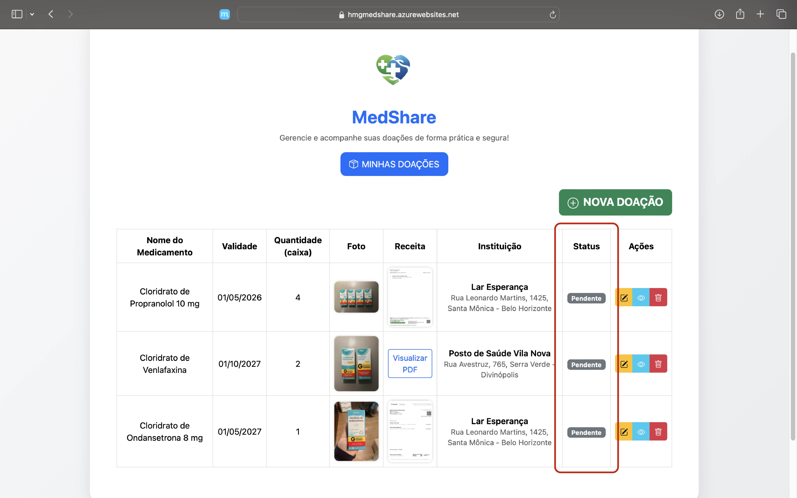

# Registro de Testes de Software

| **Caso de Teste** 	| **CT01.01 – Cadastro de doador**	|
|:---:	|:---:	|
|	Requisito Associado 	| RF-01 - A aplicação deve permitir que doadores (pessoa física) e instituições (pessoa jurídica) cadastrem seus perfis. |
|Registro de evidência | [CT01](https://l1nq.com/CadastroDoador) |

| **Caso de Teste** 	| **CT01.02 – Cadastro de instituição** 	|
|:---:	|:---:	|
|	Requisito Associado 	| RF-01 - A aplicação deve permitir que doadores (pessoa física) e instituições (pessoa jurídica) cadastrem seus perfis. |
|Registro de evidência | [CT01](https://l1nq.com/CadastroInstituicao) |

| **Caso de Teste** 	| **CT02 – Login com credenciais válidas**	|
|:---:	|:---:	|
|	Requisito Associado 	| RF-02 - A aplicação deve permitir que um usuário previamente cadastrado faça login. |
|Registro de evidência | [CT02](https://sl1nk.com/ValidacaoLogin) |

| **Caso de Teste** 	| **CT03 – Cadastro de medicamentos**	|
|:---:	|:---:	|
|	Requisito Associado 	| RF-03 - O doador deve cadastrar medicamentos informando nome, validade, quantidade, foto e receita digitalizada. |
|Registro de evidência |[CT03](https://l1nq.com/VuiE0) |

| **Caso de Teste** 	| **CT04 – Seleção de instituição para doação do medicamento**	|
|:---:	|:---:	|
|	Requisito Associado 	| RF-04 - O doador deve selecionar uma instituição específica para doar o medicamento. |
|Registro de evidência | [CT04](https://sl1nk.com/8NKIt) |

| **Caso de Teste** 	| **CT05 – Acompanhamento de status das doações**	|
|:---:	|:---:	|
|	Requisito Associado 	| RF-05 - O doador deve acompanhar o status das suas doações em uma tela dedicada ("Minhas Doações"). |
|Registro de evidência |  |

## Relatório de testes de software

Durante a fase inicial de testes, algumas falhas foram identificadas, especialmente relacionadas à fluidez e à conectividade entre as funcionalidades. Embora cada parte do sistema funcionasse individualmente, elas não estavam plenamente integradas, o que comprometia o fluxo geral e impedia que determinadas ações ocorressem de maneira contínua e coerente. Além disso, alguns ajustes nas telas foram necessários para garantir que cada elemento acionasse a função correta, conforme previsto no projeto.

Apesar dessas fragilidades iniciais, os testes também evidenciaram pontos fortes importantes: quando as funcionalidades estavam alinhadas, o sistema demonstrava bom desempenho, navegação intuitiva e potencial para atender plenamente aos objetivos propostos.

Após a identificação desses pontos, foram realizados ajustes no código, refinamentos na interface e revisões na lógica de integração entre as telas e funcionalidades. Com essas correções, todo o conjunto passou a rodar corretamente e conforme esperado, proporcionando uma experiência mais estável e consistente.

Com base nesses resultados, o grupo seguirá aprimorando a solução nas próximas iterações, fortalecendo a integração entre módulos, otimizando a usabilidade e garantindo que futuras melhorias contribuam para a evolução contínua do projeto.
